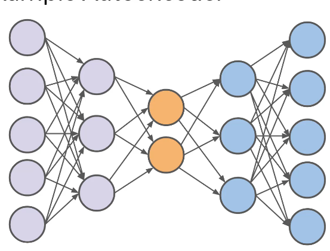
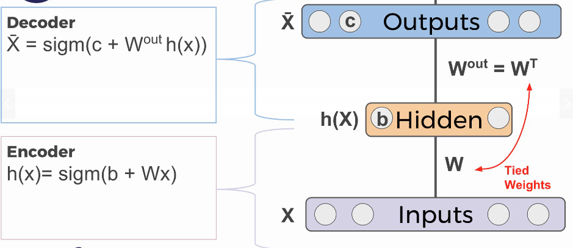

# AutoEncoder Network

## Overall

- `Reproduce` input at output layer
- number of input neurons `is equal` outputs'

### Components

### Usecases

- Extract meaningful features
- Dimensionality Reduction ~ Compression
  - PCA with Autoencoders
- Reconstruct images

## Dimensionality Reduction

### How

1. Encoder create new fewer features from input features
   - ex: construct 2 new features from 3
