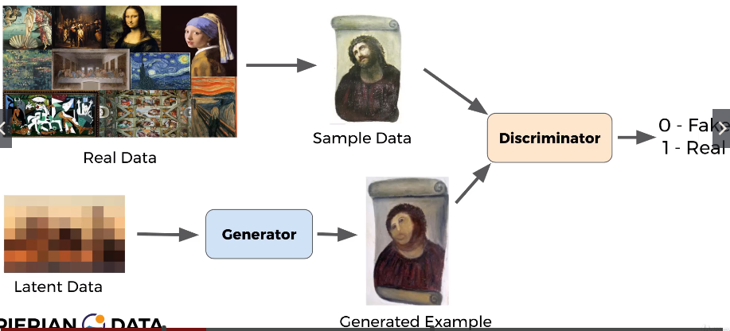

# Generative Adversial Network

## Structures

- GAN includes `2 Networks` Generator (G) and Discriminator (D).
- D compete G
  - D decide whether I and I' is fake or real
  - G try to generate image
    - try to fool D
    - if not -> improve I' till I and I' cannot be distinguishable

## Problems

1. D overpowering G
   - D classifies all I' as fake, because
     - sigmoid -> [0, 1] ~ close to 0 -> fake
   - solved by
     - `unscaled` output of D (instead of sigmoid)
1. Mode collapse
   - G happen to find `weakness of D`
     - G produces continuosly similar I', even different images I
   - solved by
     - adjusting training rate, or
     - make D better by changing layer of D
1. Long-training time

udemy-tensorflow-1.4: https://www.udemy.com/course/complete-guide-to-tensorflow-for-deep-learning-with-python/
