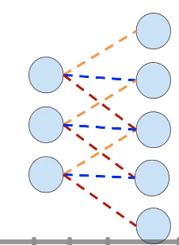
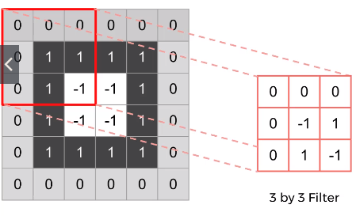
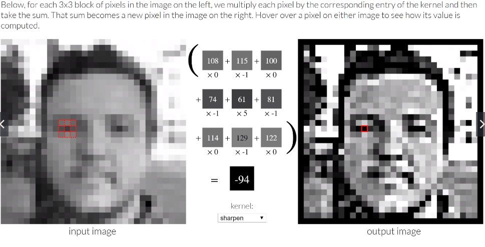
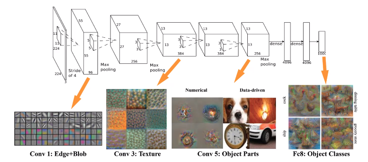
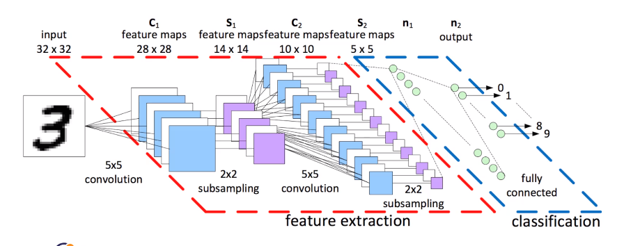

# Basic Module how to do CNN models with Tensorflow

## Initializations of Weights

- Zeros
  -> (random) -> sadle points -> not great choice
- Random Distribution Near Zero
  -> distoration of act func
- Xavier (Glorot) Initialization
  -> uniform | normal
  . draw weights from a distribution (0, var)

## Neurons | Perceptions

- Linear z = W . X + B

## Activations

- ReLu
- Sigmoid
- ...

## Loss

- Coss | Loss Function
  - Quadratic
  - Cross-Entropy

## Optimizations

- Gradient Descent (Backpropagate)
  - learning rate = ~ steps size during gradient descent
- Second-Order-Behaviors
  - to adjust learning rate
  - like AdamGrad, RMSProp, Adam
- Regularization

  - with learning rate

- Problem of Vanishing Gradients
  - Gradient towards zero after n-layers
    - No update of weights
    - No or very long converging
    - Very strong in RNN
  - Solved by
    - Initialization (mitigate)

## Overfitting | Underfitting problems

- Underfitting
  - high err in training and testing
- Overfitting
  - low err on training, very large in testing
- Mitigated by
  - L1 | L2 regularization (general)
    - penalty for larger weights
  - Dropout
  - Expanding data
    - add noise
    - tilting images
    - add white noise to sound data

## Others

- Softmax layer (Softmax Regression)

## CNN-based theory

- Visual cortex by Hubel and Wiesel (1981)

  

  - small local receptive field
    - local subsection of view
    - pixels nearby, are _much correlated_
    - parallel
  - implemented by Yann Lecun (1998)

    - LeNet

    

    
  - invariance **???**
    - reduce size
    - ...
- Tensor

  - scalar ~ 3
  - vector ~ [3,4,5]
  - matrix [ [3,4], [5,6], [7,8] ]
  - tensor [ [ [1,2] , [3,4] ] ,
    [ [5,6] , [7,8] ] ]
    - image = a tensor (H, W, C)
    - images = n tensor (n, H, W, C)
      - (n ~ number of images)

- Convolution Operation
  ~ [demo of convolution](setosa.io/ev/image-kernels)
  ~ vs relation operation
  - filter
    - filter size
    - stride
    - padding
- Pooling ~ Subsampling
  - max-pool or avg-pool
  - remove input info - 2x2 can reduce 75%
    ~ similarly, dropout

