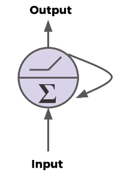
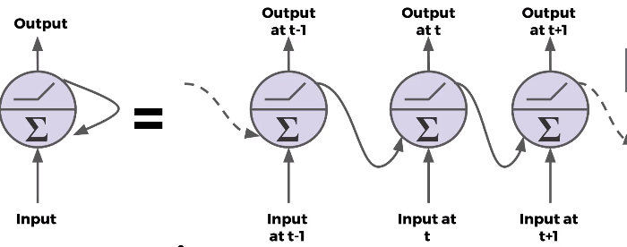
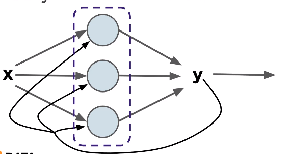
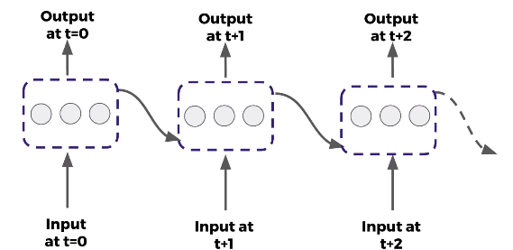
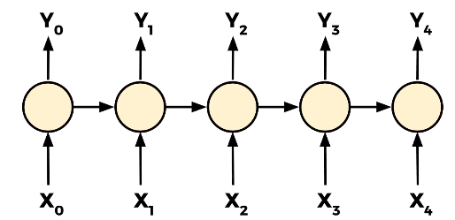
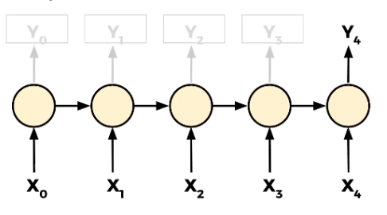

# Basic Module how to do RNN models with Tensor-flow

## Recurrent Neural Network (RNN) theory

### Sequence Data

- Time Series
- Sentences
- Audio
- Car Trajectories
- Music

### Recurrent Neuron

- send output back to itself

  - assume neuron (Agg|Activation)
    - CNN: neuron --> next neuron
    - RNN: neuron -> back current neuron (but actually, different t)
  - a RNN neuron = memory cell(s)

- Rolled vs Unrolled structure

  

  - a rolled layer

  

  - an unrolled layer

  

- inputs -> outputs

  - Sequence to Sequence

    - shift 1 step forward, but same length
      . [1,2,3,4,5] -> [2,3,4,5,6]

      

  - Sequence to Vector

    - output could be any from scalar or vector of anything

      - [1,2,4,5,6] -> [7, 8]
      - ["The", "move", "is", "done"] -> [0.1, 0.5] (word embedding)

      

      - y4 is an vector

  - Vector to Sequence

    - single time step -> get sequence of next
      . current move -> next (5 moves)

      

## Vanishing Gradients

- Problem
  - Gradients --> 0 in lower layers --> weights not updated
- Solved by:
  - Leaky ReLu instead of ReLu
  - Exponential Linear Unit (ELU)
  - Gradient Clipping
  - Batch Normalization ?

## Another issue of RNN

## Common Models

- LSTM units -> important concept
  - Problem of RNN
    - Forgetting after a while
      - Loass previous info gradually
  - solved by
    - "long-term memory" -> LSTM
  - structure
    - inputs ~ x, c, h
      - cell state c
    - (optional) + peephole
- GRU units (Gated Recurrent Unit)
  - Simpler version of LSTM

## Applications

- Time Series
- Word2Vec
